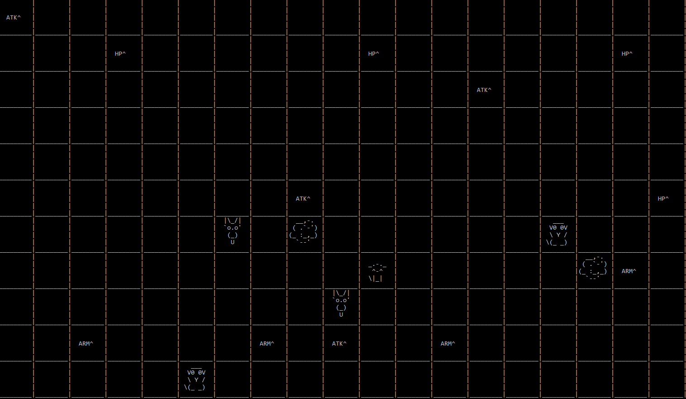

# Survival game

## Rules

- At the start of the game characters and items are spawned on random tiles.
- Only one character is controlled by user input and that is one of the ghosts.
- All other characters are NPCs.
- Items can be picked up by walking over them.
- Two characters engage into a fight if they are on the same tile.
- Characters damage each other until one of them runs out of HP.
- The player that engages a fight is the one to attack first.
- Last standing player wins.
- The kitty is OP so it is the most likely to win.

## Demo

Here I am playing as the ghost at the bottom of the screen.

## Project description

Besides utility classes there are 4 base classes in this project.

1. The Engine class which handles keyboard input, rendering and glues everything together.
2. The Actor class which is the base class for most things that are meant to be have a visual representation or create some sort of interaction (characters, objects, pickups, etc).
3. The Scene class on which Actors are placed.
4. The Controller class which can be found on Character classes and implements Character's behavior.

The rendering part is quite interesting because it avoids the flash of re-render you would see in many console games. It does that by only changing those bits on the screen that need to update. For instance, if a character moved from a tile to another tile, only those two tiles would update and every thing else would stay the same. This is achieved by moving the console's cursor only across the parts which need to be refreshed.

## Build details

This project was built on Windows 10 Pro using Visual Studio 2017 Enterprise in April 2018. The console had the fallowing settings:

- width: 195
- height: 60
- font name: Consolas
- font size: 16
- Wrap text output on resize: unchecked
